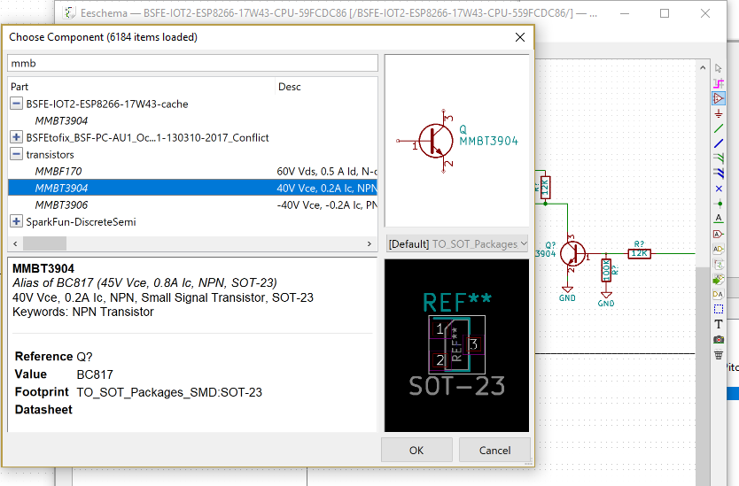

| ACTION | TEST | STEPS and observations | Screen Shots|
|--------------------------------|------------------------------------------|--------------------------------------------------------------------------------------------------|-----------------------------------------------------------------------------------------------------|
| Adding a new Part to Schematic | Does Part already exist in Kicad Library | kicad library, Content is managed in a GIT repository | <li>Part Research,</li><li>Part Analysis (Cost, Engineering)</li><li>Part Data Curate</li><li>Part Inventory Management (Life cycle )</li><li></li></ul>   DONE: <ul><li>Part Symbol maintenance</li><li>Part Footprint Maintenance</li></ul> |
|  | Part Not in Kicad Library                
| | |  MANUAL STEPS REQUIRED: <ul><li>Part Research</li><li>Part Analysis (Cost, Engineering) </li><li>Part Schematic Symbol and Footprint (Draw, Aquire) place in Organization Library, Part Footprint</li><li>  ----  If New part drawn: share to Kicad Library Repository </li><li>Part Data Curate </li><li>Part Inventory Management (Life cycle )</li><li></li><li></li> </ul>|                                                                          Assorted Tools plenty of adhoc manual processs                           BOMscripts , Spreadsheets, Boms-away, Kipartman   MRP ……..        usually post schematic capture lots of bom management and trying to capture bom details in schematic  
